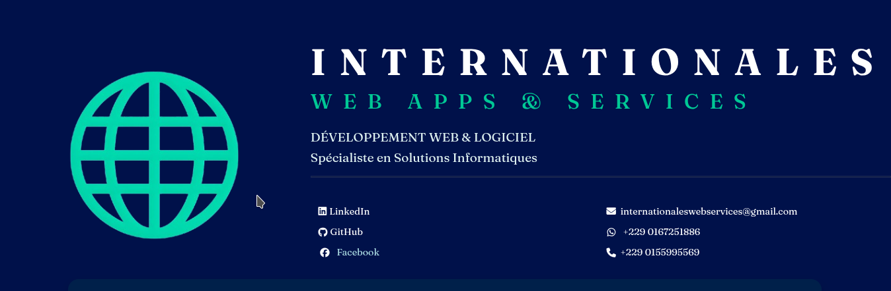
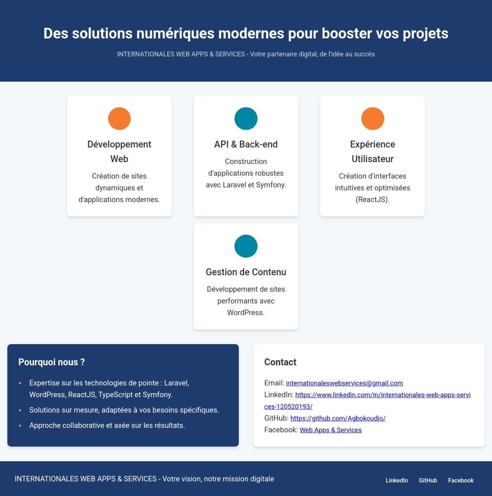

# Présentation pour INTERNATIONALES WEB APPS & SERVICES

## Présentation du projet

Ce projet est un text de presentation web simple et élégant, conçu pour présenter les services de notre agence, INTERNATIONALES WEB APPS & SERVICES. Il a été développé pour servir de carte de visite digitale, mettant en avant nos compétences techniques, notre approche orientée client et nos services.

L'objectif principal était de créer une page responsive (adaptable aux mobiles et ordinateurs), en utilisant uniquement du code HTML et CSS, sans l'aide de frameworks ni de bibliothèques externes. Cela démontre notre maîtrise des fondamentaux du développement web.

## Technologies utilisées

* **HTML5** : Pour la structure de la page.
* **CSS3** : Pour le stylisme et la création d'une interface utilisateur agréable et responsive.

## Fonctionnalités

* **Design Responsive** : La page s'adapte automatiquement à toutes les tailles d'écran.
* **Présentation des services** : Mise en évidence de notre expertise en développement web, API, expérience utilisateur et gestion de contenu.
* **Détails de contact** : Informations pour joindre notre agence sur les réseaux sociaux.

## Aperçu de la page

Voici un aperçu de la page web, tel qu'elle s'affiche sur un écran d'ordinateur de bureau.

---

## Lien vers le projet en direct

* [https://www.github.com/Agbokoudjo/]

---

© 2025 INTERNATIONALES WEB APPS & SERVICES. Tous droits réservés.
